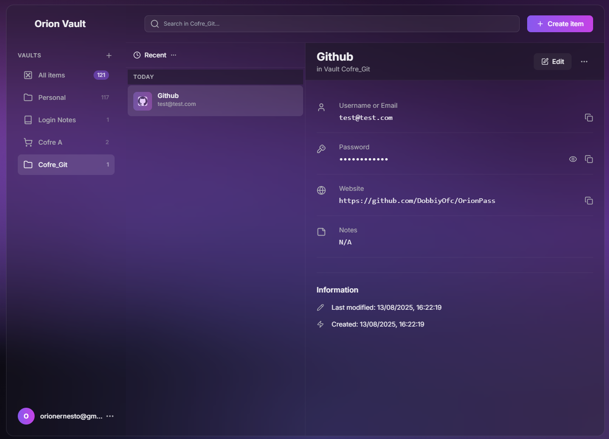
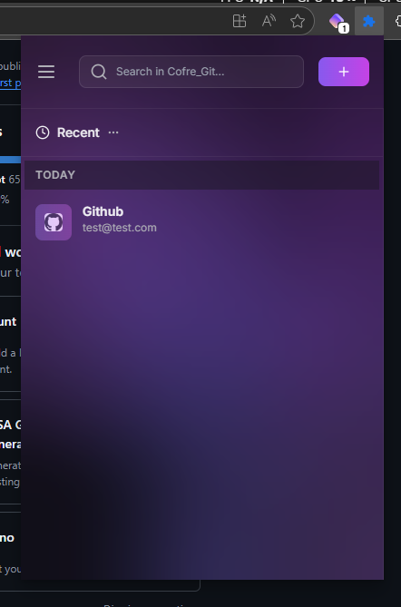
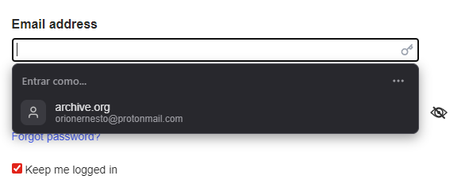
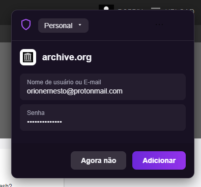

# Orion Vault: A Modern, Client-Side Password Manager

[](https://opensource.org/licenses/MIT)

Orion Vault is a secure, open-source password manager designed with privacy and security as its core principles. It uses a client-server architecture where all your data is end-to-end encrypted on your device before being synced to a secure backend. This allows you to access your vault from anywhere, while ensuring that your master password and unencrypted data never leave your device.

**This project serves as a comprehensive, production-quality reference architecture for building secure browser extensions.**

---

## 📸 Screenshots

**Main View (Full Tab)**



**Extension Popup**



**Autofill Prompt**



**New Login Notification**



---


## Philosophies

-   **Zero-Knowledge:** Your data is your data. Your master password is used to derive an encryption key in your browser and is never stored or transmitted. We, the creators, have zero access to it.
-   **Client-Side First:** All cryptographic operations happen locally in your browser via the Web Crypto API. The backend is treated as an untrusted, encrypted blob store.
-   **Modern & Performant:** Built with a modern tech stack (React, TypeScript, Tailwind CSS) for a clean, fast, and responsive user experience.
-   **Open Source & Transparent:** The code is open for anyone to inspect, audit, and contribute to.

## ✨ Key Features

-   **End-to-End Encryption:** Uses Argon2id for key derivation and AES-256-GCM for data encryption.
-   **Cross-Device Sync:** Securely syncs your encrypted vault via a backend server.
-   **Multiple Vaults:** Organize your credentials into different vaults (e.g., Personal, Work).
-   **Multiple Item Types:** Store not just logins, but also secure notes.
-   **Secure Password Generator:** Create strong, cryptographically random passwords with customizable options.
-   **Data Import/Export:** Easily import your existing data from other password managers and export your vault.
-   **Credential Autofill:** Securely offers to fill credentials for known websites.
-   **Localization:** Supports multiple languages (English, Spanish, Portuguese).
-   **Responsive Design:** A clean, modern UI that works across popups and full-page views.

## 🔐 Security Model

Orion Vault is built on a zero-knowledge architecture.

1.  **Master Password:** When you register, your master password is combined with a random salt and passed through the **Argon2id** key derivation function. This creates a strong wrapping key. Your master password is then discarded and is never stored.
2.  **Data Key:** A separate, strong encryption key (an AES-256 key) is generated to encrypt/decrypt your actual vault items (logins, notes).
3.  **Key Wrapping:** The wrapping key (from step 1) is used to encrypt ("wrap") your data key (from step 2). This encrypted data key is the only key-related material stored on the server.
4.  **Login:** To log in, you provide your master password. The app fetches your salt and encrypted data key from the server. It then re-derives the wrapping key using the stored salt and your password and attempts to decrypt the data key. If successful, you are authenticated, and the decrypted data key is held in memory for your session to decrypt your items.
5.  **Client-Side Operations:** All cryptographic operations happen exclusively in your browser. Unencrypted data is never sent over the network or stored permanently. The backend only ever sees encrypted blobs of data.

## 🛠️ Tech Stack

-   **Frontend:** React 18, TypeScript
-   **Styling:** Tailwind CSS
-   **Cryptography:**
    -   `@noble/hashes` (Argon2id) for KDF (Key Derivation Function)
    -   Web Crypto API (AES-256-GCM) for encryption/decryption
-   **State Management:** React Context API
-   **Internationalization:** `i18next`
-   **Build Tool:** esbuild

## 🚀 Getting Started

### For Users (Installation)

The extension is not yet published to official browser stores. To use it, you can load it as an "unpacked extension" in a Chromium-based browser (like Chrome, Edge, or Brave).

1.  First, [build the extension for production](#-building-for-production). This will create a `dist/` folder.
2.  Open your browser and navigate to the extensions page (e.g., `chrome://extensions`).
3.  Enable "Developer mode" (usually a toggle in the top-right corner).
4.  Click the "Load unpacked" button.
5.  Select the `dist` folder from this project's directory.

The Orion Vault icon should now appear in your browser's toolbar.

### For Developers (Local Setup)

This project uses a client-server model. The frontend communicates with a backend API (as defined in `BACKEND_API.md`) for all data persistence. The `services/apiService.ts` file handles these communications.

**Prerequisites:**

-   A running backend server that is compatible with the `BACKEND_API.md` specification.
-   [Node.js](https://nodejs.org/) (version 18.x or later recommended)
-   [npm](https://www.npmjs.com/) (usually comes with Node.js)

**Installation & Running:**

1.  **Configure API Endpoint:** Open `services/apiService.ts` and change the `API_BASE` and `DATA_API_BASE` constants to point to your backend server.

2.  **Clone the repository:**
    ```bash
    git clone https://github.com/DobbiyOfc/OrionPass
    cd orion-vault
    ```

3.  **Install dependencies:**
    ```bash
    npm install
    ```

4.  **Run the build script in watch mode:**
    ```bash
    npm run build -- --watch
    ```
    This command will perform an initial build and then watch for file changes, rebuilding automatically.

5.  **Load the unpacked extension:**
    Follow the "For Users" installation steps above. The `dist` folder will be kept up-to-date by the watch script. After making changes to the source code, you may need to click the "reload" button for the extension on the `chrome://extensions` page.

## 📦 Building for Production

To create a production-ready build of the extension, you need to compile the TypeScript/React code and package all necessary files. An `esbuild`-based script is provided for this.

1.  **Install development dependencies (if you haven't already):**
    ```bash
    npm install
    ```

2.  **Run the build script:**
    ```bash
    npm run build
    ```

This command will:
-   Clean the `dist/` directory.
-   Compile, transpile, and minify the source code.
-   Copy all static assets (`manifest.json`, HTML files, icons, etc.) into `dist/`.

The final, loadable extension will be located in the `dist/` folder.

## 🤝 Contributing

Contributions are what make the open-source community such an amazing place to learn, inspire, and create. Any contributions you make are **greatly appreciated**.

If you have a suggestion that would make this better, please fork the repo and create a pull request. You can also simply open an issue with the tag "enhancement".

1.  Fork the Project
2.  Create your Feature Branch (`git checkout -b feature/AmazingFeature`)
3.  Commit your Changes (`git commit -m 'Add some AmazingFeature'`)
4.  Push to the Branch (`git push origin feature/AmazingFeature`)
5.  Open a Pull Request

## 📄 License

Distributed under the MIT License. See `LICENSE.txt` for more information.

## 📁 Project Structure

```
/
├── components/      # React components (UI)
├── contexts/        # React context providers for state management
├── locales/         # i18n translation files
├── services/        # Core logic (crypto, api communication)
├── utils/           # Helper functions
│
├── App.tsx          # Main App component
├── index.tsx        # Application's main entry point
│
├── index.html       # HTML for the full-page application view
├── popup.html       # HTML for the extension's popup view
│
├── manifest.json    # The core configuration for the browser extension
├── background.js    # The extension's service worker (background logic)
├── content_script.js# Injects logic into web pages (e.g., for autofill)
│
├── build.js         # esbuild script for compiling the extension
├── tailwind.config.js # Tailwind CSS configuration
└── ...
```
For developers interested in creating a custom backend, please refer to the `BACKEND_API.md` file for the expected API contract.
